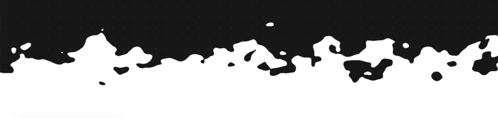
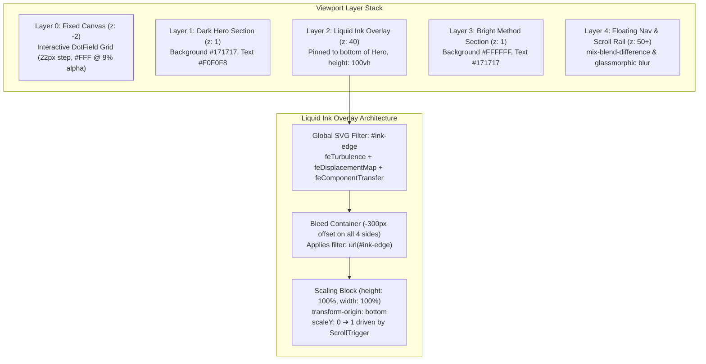

# weevolveit.com — Liquid Ink Scroll Transition Handoff

Reverse-engineered from the production bundle (Next.js 16.2.6 / Turbopack, deployment `dpl_BnFaStQMpSm1yo9EERroHjWqAKp9`). Everything below is extracted directly from shipped client bundles (`0mc1t21lq~25w.js` and `17bnzfxtitvxg.js`), not inferred.



---

## 1. Overview & Visual Architecture

As the user scrolls down from the dark `#171717` Hero section toward the bright `#FFFFFF` Method section, a white liquid organic ink boundary rises from the bottom of the viewport and expands upward until the entire viewport is flooded with white, creating a seamless handoff into the Method framework track.



---

## 2. Core Transition Mechanism: The `#ink-edge` SVG Filter

The organic liquid boundary is generated entirely in real-time through procedural SVG filter primitives. It does **not** use static SVG vector artwork, video, canvas rasterization, or WebGL shaders.

### Exact Shipped Filter Definition

```xml
<svg width="0" height="0" aria-hidden="true" style="position: absolute; pointer-events: none;">
  <defs>
    <filter id="ink-edge" x="-10%" y="-10%" width="120%" height="120%">
      <!-- 1. Procedural 2D Fractal Noise -->
      <feTurbulence
        type="fractalNoise"
        baseFrequency="0.015 0.02"
        numOctaves="3"
        seed="7"
        result="noise"
      />

      <!-- 2. Coordinate Displacement (Scale: 220px) -->
      <feDisplacementMap
        in="SourceGraphic"
        in2="noise"
        scale="220"
        xChannelSelector="R"
        yChannelSelector="G"
        result="displaced"
      />

      <!-- 3. Pre-smoothing for Thresholding -->
      <feGaussianBlur
        in="displaced"
        stdDeviation="1.8"
        result="presmooth"
      />

      <!-- 4. Discrete Alpha Step / High-Contrast Binarization -->
      <feComponentTransfer in="presmooth" result="cut">
        <feFuncA type="discrete" tableValues="0 0 0 0 0 1 1 1 1 1" />
      </feComponentTransfer>

      <!-- 5. Sub-pixel Anti-aliasing -->
      <feGaussianBlur
        in="cut"
        stdDeviation="0.4"
      />
    </filter>
  </defs>
</svg>
```

### Stage-by-Stage Breakdown

| Stage                | Primitive             | Parameters                                                                                                     | Engineering Purpose                                                                                                                                                                                                                                                    |
| :------------------- | :-------------------- | :------------------------------------------------------------------------------------------------------------- | :--------------------------------------------------------------------------------------------------------------------------------------------------------------------------------------------------------------------------------------------------------------------- |
| **1. Noise**         | `feTurbulence`        | `type="fractalNoise"`<br/>`baseFrequency="0.015 0.02"`<br/>`numOctaves="3"`<br/>`seed="7"`                     | Generates continuous, anisotropic Perlin noise with low spatial frequency (coarser horizontal frequency `0.015`, slightly tighter vertical `0.02`).                                                                                                                    |
| **2. Displacement**  | `feDisplacementMap`   | `in="SourceGraphic"`<br/>`in2="noise"`<br/>`scale="220"`<br/>`xChannelSelector="R"`<br/>`yChannelSelector="G"` | Takes the sharp linear top edge of a plain rectangle and distorts its pixel coordinates by up to **±110px** (`scale=220`) in 2D space.                                                                                                                                 |
| **3. Pre-smooth**    | `feGaussianBlur`      | `stdDeviation="1.8"`                                                                                           | Softens high-frequency artifacts and jagged displacement boundaries into a smooth gradient band before slicing.                                                                                                                                                        |
| **4. Binarization**  | `feComponentTransfer` | `<feFuncA type="discrete" tableValues="0 0 0 0 0 1 1 1 1 1" />`                                                | **The critical step:** Acts as a Heaviside step / threshold filter on alpha. Pixels with $\alpha < 0.5$ snap to $0$ (transparent); pixels with $\alpha \ge 0.5$ snap to $1.0$ (solid white). This turns the displaced blur into distinct droplets and liquid tendrils. |
| **5. Anti-aliasing** | `feGaussianBlur`      | `stdDeviation="0.4"`                                                                                           | Re-introduces sub-pixel softness to the hard binarized staircasing edge, making it smooth on retina displays.                                                                                                                                                          |

---

## 3. DOM Geometry & The 300px Bleed Container

Because `feDisplacementMap` has an extreme displacement amplitude of `scale="220"`, rendering it inside a standard boundary would cause displaced pixels to clip violently at the left, right, and top edges.

WeEvolveIT resolves this using a **300px negative bleed container**:

```html
<!-- Pinned to bottom of the dark section -->
<div
  aria-hidden="true"
  style="
  position: absolute;
  bottom: 0;
  left: 0;
  right: 0;
  height: 100vh;
  z-index: 40;
  overflow: hidden;
  pointer-events: none;
"
>
  <!-- Extended 300px outward in every direction -->
  <div
    style="
    position: absolute;
    top: -300px;
    left: -300px;
    right: -300px;
    bottom: -300px;
    filter: url(#ink-edge);
    will-change: transform;
  "
  >
    <!-- The scaling white rectangle -->
    <div
      ref="{inkBlockRef}"
      style="
      position: absolute;
      bottom: 0;
      left: 0;
      width: 100%;
      height: 100%;
      background: #FFFFFF;
      transform-origin: bottom;
      will-change: transform;
    "
    ></div>
  </div>
</div>
```

> **Important**: The outer container has `overflow: hidden` to clip the overall effect to the viewport, while the inner container has `top: -300px; left: -300px; right: -300px; bottom: -300px`. This guarantees that the ±110px displacement has ample bleed margin on all four sides.

---

## 4. Scroll Animation & GSAP ScrollTrigger Logic

### Scroll Trigger Configuration

- **Target Element**: The inner white rectangle (`scaleY`).
- **Trigger Element**: The following light section (`[data-method]`).
- **Start Boundary**: `"top bottom"` (the exact frame the top edge of the light section meets the bottom of the viewport).
- **End Boundary**: `"top -25%"` (when the light section top has scrolled 25% beyond the top of the viewport).
- **Scrub**: `true` (smoothly linked to the scroll position).

### The Custom Piecewise Easing Curve

```javascript
ease: (p) => (p < 0.02 ? (p / 0.02) * 0.18 : 0.18 + ((p - 0.02) / 0.98) * 0.82);
```

#### Why this exact formula is necessary:

1. **Compensating for Noise Troughs**: Because of the 220px displacement and 300px bleed, if `scaleY` started climbing strictly linearly from `0.0`, the highest noise peak would not peek above the bottom of the screen until scroll progress reached ~12-15%.
2. **Instant Visual Response**: Over the initial 2% of scroll travel ($p \in [0, 0.02]$), the scale ramps rapidly to `0.18` (18% of viewport height). This ensures liquid droplets immediately surge into view the instant the user begins scrolling.
3. **Linear Takeover**: For the remaining 98% of scroll travel ($p \in [0.02, 1.0]$), it scales linearly from `0.18` to `1.0`, ensuring natural pacing.

---

## 5. Background Canvas (`DotField`) & Click Ripples

Behind the entire page sits a full-screen canvas (`z-[-2]`) running high-DPI rendering and an interactive click shockwave simulation.

```javascript
// Dot Grid Spacing Constants
const GRID_STEP = 22; // Spacing between dots in pixels
const GRID_OFFSET = 11; // Centering offset
const DOT_RADIUS = 1; // Radius in pixels
const BASE_ALPHA = 0.09; // "rgba(255, 255, 255, 0.09)"
```

### Interactive Click Shockwave Physics

When the user clicks anywhere on the dark hero (excluding buttons and links), a radial impulse is dispatched:

- **Propagation Speed**: $380\text{ px/s}$
- **Ring Thickness**: $80\text{ px}$
- **Lifespan**: $2.2\text{ seconds}$
- **Peak Radial Displacement**: $14\text{ px}$ (with cosine falloff across the 80px ring)
- **Peak Brightness Boost**: $+0.28$ alpha (fade out over 2.2s)

---

## 6. Design Tokens & Styling System

| Token                 | Dark Section (Hero)         | Bright Section (Method)   | Description                          |
| :-------------------- | :-------------------------- | :------------------------ | :----------------------------------- |
| **Background**        | `#171717` (`--color-bg`)    | `#FFFFFF` (`--method-bg`) | Primary canvas tone                  |
| **Foreground**        | `#F0F0F8` (`--color-fg`)    | `#171717` (`--method-fg`) | High-contrast text                   |
| **Muted Text**        | `rgba(240, 240, 248, 0.48)` | `rgba(23, 23, 23, 0.6)`   | Secondary labels & subheads          |
| **Accent**            | `#E4007C`                   | `#E4007C`                 | Electric Magenta / Hot Pink          |
| **Border / Hairline** | `rgba(255, 255, 255, 0.1)`  | `rgba(0, 0, 0, 0.1)`      | Sub-pixel separators                 |
| **Display Font**      | `Geist Mono`                | `Geist Mono`              | Headings (`letter-spacing: -0.04em`) |
| **Mono Font**         | `JetBrains Mono`            | `JetBrains Mono`          | Body, badges, UI elements            |

### Cross-Theme UI Adaptation

- **Scroll Tracker Rail**: Styled with `mix-blend-mode: difference`. As the white ink rises underneath it, the rail and thumb automatically invert from white-on-dark to dark-on-white without any JavaScript theme toggles.
- **Header Island**: Uses `backdrop-filter: blur(16px)` and `background: rgba(23, 23, 23, 0.7)` with rounded pill corners (`rounded-[32px]`).

---

## 7. Production-Ready React / Next.js Implementation

This component is already implemented in this codebase at `src/components/animations/liquid-ink-transition.tsx`:

```tsx
'use client';

import { prefersReducedMotion } from '@/lib/preferences';
import { useGSAP } from '@gsap/react';
import gsap from 'gsap';
import { ScrollTrigger } from 'gsap/ScrollTrigger';
import { useRef } from 'react';

interface LiquidInkTransitionProps {
  targetId: string;
  color?: string;
}

function InkFilterDefinition() {
  return (
    <svg width="0" height="0" aria-hidden="true" style={{ position: 'absolute', pointerEvents: 'none' }}>
      <defs>
        <filter id="ink-edge" x="-10%" y="-10%" width="120%" height="120%">
          <feTurbulence type="fractalNoise" baseFrequency="0.015 0.02" numOctaves={3} seed={7} result="noise" />
          <feDisplacementMap
            in="SourceGraphic"
            in2="noise"
            scale={220}
            xChannelSelector="R"
            yChannelSelector="G"
            result="displaced"
          />
          <feGaussianBlur in="displaced" stdDeviation={1.8} result="presmooth" />
          <feComponentTransfer in="presmooth" result="cut">
            <feFuncA type="discrete" tableValues="0 0 0 0 0 1 1 1 1 1" />
          </feComponentTransfer>
          <feGaussianBlur in="cut" stdDeviation={0.4} />
        </filter>
      </defs>
    </svg>
  );
}

function useLiquidInkAnimation(
  scopeRef: React.RefObject<HTMLDivElement | null>,
  inkScaleRef: React.RefObject<HTMLDivElement | null>,
  targetId: string,
) {
  useGSAP(
    () => {
      gsap.registerPlugin(ScrollTrigger);
      const target = inkScaleRef.current;
      const trigger = document.getElementById(targetId);
      if (!target || !trigger || prefersReducedMotion()) return;

      gsap.set(target, { scaleY: 0 });

      gsap.to(target, {
        scaleY: 1,
        ease: (p: number) => (p < 0.02 ? (p / 0.02) * 0.18 : 0.18 + ((p - 0.02) / 0.98) * 0.82),
        scrollTrigger: {
          trigger,
          start: 'top bottom',
          end: 'top -25%',
          scrub: true,
        },
      });
    },
    { scope: scopeRef },
  );
}

export function LiquidInkTransition({ targetId, color = '#FFFFFF' }: LiquidInkTransitionProps) {
  const containerRef = useRef<HTMLDivElement>(null);
  const inkScaleRef = useRef<HTMLDivElement>(null);

  useLiquidInkAnimation(containerRef, inkScaleRef, targetId);

  return (
    <div
      ref={containerRef}
      aria-hidden="true"
      className="pointer-events-none absolute bottom-0 left-0 right-0 h-screen z-40 overflow-hidden"
    >
      <InkFilterDefinition />
      <div
        style={{
          position: 'absolute',
          top: -300,
          left: -300,
          right: -300,
          bottom: -300,
          filter: 'url(#ink-edge)',
          willChange: 'transform',
        }}
      >
        <div
          ref={inkScaleRef}
          style={{
            position: 'absolute',
            bottom: 0,
            left: 0,
            width: '100%',
            height: '100%',
            backgroundColor: color,
            transformOrigin: 'bottom',
            willChange: 'transform',
          }}
        />
      </div>
    </div>
  );
}
```
